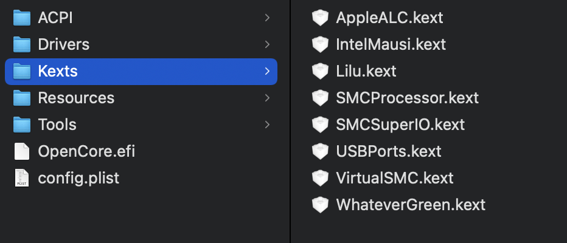
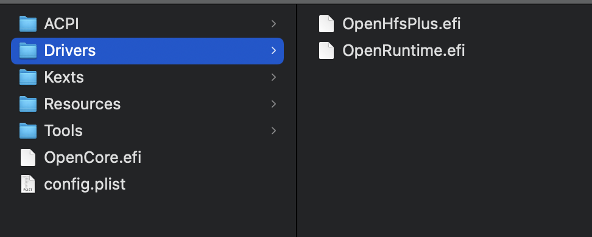

# sff build PCVR Gaming - macOS
> This repository is actually a config from sff build. this sff build can handle PCVR games and macOS. if you consider to use it: Do it your own risks!    

   
 
# Specification

## Hardware

- Intel i5 8600K
- Gigabyte [Aorus Z390i](https://www.gigabyte.com/Motherboard/Z390-I-AORUS-PRO-WIFI-rev-10/sp#sp):  
   - Chipset: Intel® Z390 Express  
   - Audio: Realtek ALC1220-VB  
   - Ethernet: Intel GbE LAN Chip (Gigabit LAN 10/100/1000 Mbit/s)  
   - Wifi: Intel CNVi interface 802.11a/b/g/n/ac, 2.4/5 GHz Dual-Band 
   - 1 USB-C 3.1 gen 2
   - 1 USB-A 3.1 gen 2  
- RAM: 16gb  
- GPU: Sapphire RX 580 8Gb

## OS :

- macOS Catalina (10.15.6) : :white_check_mark: Tested
- macOS Big Sur (11.1) : :white_check_mark: Tested
- Windows 10 (20H2) : :white_check_mark: Tested

## Bootloader

- [OpenCore 0.6.4](https://github.com/acidanthera/OpenCorePkg/releases/)

then, how to use it? follow the instructions below

# How to

## Create macOS installer

- with [macOS](https://dortania.github.io/OpenCore-Install-Guide/installer-guide/mac-install.html)
- with [windows](https://dortania.github.io/OpenCore-Install-Guide/installer-guide/winblows-install.html)
- with [linux](https://dortania.github.io/OpenCore-Install-Guide/installer-guide/linux-install.html)

## Adding the base bootloader

download the bootloader [here](https://github.com/acidanthera/OpenCorePkg/releases) 
after that copy the EFI folder from X64 folder to your efi volume. to mount your efi volume, i recommend [this tools](https://github.com/corpnewt/MountEFI). further instructions [here](https://github.com/acidanthera/OpenCorePkg/releases/)

## Gathering drivers and kexts

these are the kexts and drivers that I used. if you have a plan to use my `config.plist` in the future. please check again if these exist.   
   
    
fewer drivers or and kexts are better so don't put an unnecessary. further instructions you can follow this [guides](https://dortania.github.io/OpenCore-Install-Guide/ktext.html) 

## ACPI or SSDTs!

this one is a very important thing if you use a motherboard likes me (aorus z390i).
you can download it from this repository inside the EFI folder.    
    

## Final step: config.plist!

you can use mine inside this EFI folder. ofc you may modify it, I recommend this [tools](https://github.com/corpnewt/ProperTree) to do so. 
or you can make your own by following this [guides](https://dortania.github.io/OpenCore-Install-Guide/config.plist/#creating-your-config-plist)

# What's working or not working?

_Everythings are working!_ **except** the native wifi from the motherboard. if you consider using the wifi, you have to replace or add another wifi card. I recommend BCM94352Z or you can follow this [guides](https://dortania.github.io/Wireless-Buyers-Guide/unsupported.html#supported-chipsets)

# References

- [[Guide] OpenCore](https://dortania.github.io/OpenCore-Install-Guide/)
- [Wireless Buyers Guide](https://dortania.github.io/Wireless-Buyers-Guide/)

